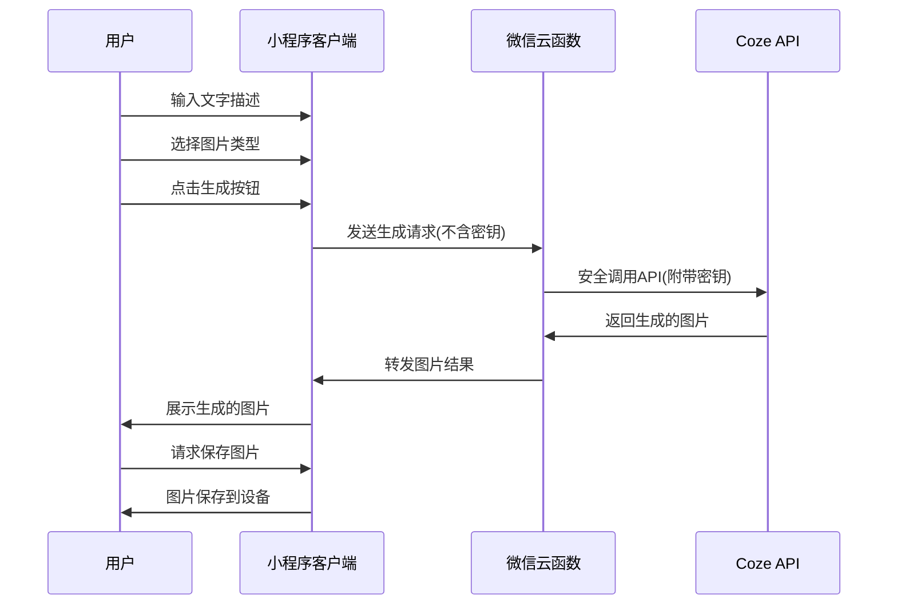

# 文字生成图片微信小程序技术方案

## 1. 项目概述

本文档基于需求分析文档，提供"文字生成图片"微信小程序的技术实现方案。该小程序允许用户通过输入文字描述，调用 Coze API 生成相应图片。

## 2. 技术选型

### 2.1 开发框架与工具

- **开发框架**：微信小程序原生开发框架
- **开发语言**：JavaScript/TypeScript
- **样式处理**：WXSS
- **状态管理**：小程序内置数据管理能力
- **图片生成**：Coze API
- **开发工具**：微信开发者工具

### 2.2 技术选型理由

- 微信小程序原生框架保证最佳兼容性和性能
- TypeScript 提供更好的类型检查，提高代码质量
- 直接对接 Coze API，无需额外的后端服务

## 3. 系统架构

### 3.1 整体架构

```mermaid
flowchart TD
    subgraph 用户端
        A([用户]) --> |1. 输入描述文字| B[小程序界面]
        B --> |8. 展示生成图片| A
        A --> |9. 请求保存图片| B
        B --> |10. 图片保存到相册| A
    end

    subgraph 小程序端
        B <--> |2. 提交请求\n7. 返回图片| C[请求处理模块]
    end

    subgraph 云端
        C --> |3. 转发请求\n(不含密钥)| D[微信云函数]
        D --> |6. 返回图片数据| C

        D --> |4. 安全调用\n(携带密钥)| E[(Coze API)]
        E --> |5. 返回生成图片| D
    end

    classDef userBox fill:#f9f,stroke:#333,stroke-width:2px
    classDef miniappBox fill:#bbf,stroke:#333,stroke-width:2px
    classDef cloudBox fill:#bfb,stroke:#333,stroke-width:2px
    classDef apiBox fill:#fbb,stroke:#f66,stroke-width:2px

    class A userBox
    class B,C miniappBox
    class D cloudBox
    class E apiBox
```

整体采用三层架构：

- **客户端层**：微信小程序，负责用户界面交互和数据展示
- **中间层**：微信云函数，负责 API 调用中转和密钥保护
- **服务端层**：Coze API，负责图片生成处理

### 3.2 数据流向时序图



### 3.3 架构流程

1. 用户在小程序中输入文字描述并选择图片类型
2. 小程序将请求发送至微信云函数（不包含 API 密钥）
3. 云函数安全地调用 Coze API（包含 API 密钥）
4. Coze API 处理请求并生成图片
5. 云函数接收图片并转发给小程序
6. 小程序接收图片并展示给用户
7. 用户可将图片保存到设备

### 3.4 API 密钥安全保障措施

为确保 Coze API 密钥的安全性，采取以下措施：

1. **使用微信云函数中转**：所有 API 请求通过微信云函数转发，API 密钥仅存储在云端，不在小程序客户端暴露
2. **环境变量存储**：将 API 密钥配置为微信云开发环境的环境变量，而非硬编码在代码中
3. **请求鉴权**：为云函数添加自定义鉴权机制，确保只有合法的小程序实例可以调用
4. **请求频率限制**：在云函数层面实现调用频率控制，防止密钥被滥用
5. **密钥定期轮换**：建立密钥定期更换机制，降低长期泄露风险
6. **访问日志监控**：实时监控 API 调用日志，及时发现异常调用行为
7. **最小权限原则**：为 API 密钥配置最小必要的权限范围

## 4. 核心功能实现

### 4.1 文字生成图片功能

- 调用 Coze API 的图像生成接口
- 根据用户选择的图片类型（人物、动漫、通用）调整 API 参数
- 处理 API 响应并展示生成的图片

### 4.2 提示词模板功能

- 在应用本地存储预设的提示词模板
- 提供模板选择界面
- 支持用户选择模板后进行编辑修改

### 4.3 图片保存功能

- 调用微信小程序的图片保存 API
- 获取用户授权后将图片保存到设备相册

## 5. 项目目录结构

```
mini-program/
│
├── app.js                 # 小程序入口文件
├── app.json               # 小程序全局配置
├── app.wxss               # 小程序全局样式
│
├── pages/                 # 页面文件夹
│   ├── index/             # 主页（图片生成页面）
│   │   ├── index.js
│   │   ├── index.json
│   │   ├── index.wxml
│   │   └── index.wxss
│   │
│   └── about/             # 关于页面
│       ├── about.js
│       ├── about.json
│       ├── about.wxml
│       └── about.wxss
│
├── components/            # 组件文件夹
│   ├── loading/           # 加载组件
│   ├── template-picker/   # 提示词模板选择组件
│   └── type-selector/     # 图片类型选择组件
│
├── services/              # 服务层
│   ├── api.js             # API调用封装
│   └── coze-service.js    # Coze API服务封装
│
├── utils/                 # 工具类
│   ├── util.js            # 通用工具函数
│   └── request.js         # 网络请求封装
│
├── constants/             # 常量定义
│   ├── templates.js       # 提示词模板数据
│   └── config.js          # 配置常量
│
└── assets/                # 静态资源
    └── images/            # 图片资源
```

## 6. API 接口设计

### 6.1 Coze API 接口

```
POST /api/generate-image
```

**请求参数**：

- `text`: 用户输入的文字描述
- `type`: 图片类型（human/anime/general）

**响应数据**：

- `image`: 生成的图片（base64 编码或 URL）
- `status`: 请求状态
- `message`: 状态描述信息

## 7. 数据模型

### 7.1 输入数据模型

```typescript
interface ImageGenerationRequest {
  text: string; // 用户输入的文字描述
  type: "human" | "anime" | "general"; // 图片类型
}
```

### 7.2 模板数据模型

```typescript
interface PromptTemplate {
  id: string; // 模板ID
  name: string; // 模板名称
  text: string; // 模板文本
  type: "human" | "anime" | "general"; // 默认图片类型
}
```

## 8. 关键技术实现细节

### 8.1 API 调用封装

封装 Coze API 调用逻辑，处理请求响应、错误处理和重试机制。

### 8.2 图片展示与保存

使用小程序提供的图片组件和 API 实现图片展示和保存功能。

### 8.3 提示词模板管理

在本地维护提示词模板数据，提供用户选择和使用。

## 9. 安全与隐私保护

- 不保存用户生成历史和输入内容
- 只在 API 调用过程中传输必要数据
- 采用 HTTPS 保证传输安全

## 10. 性能优化方案

- 图片懒加载处理
- 请求节流控制，避免频繁 API 调用
- 加载状态展示，优化用户体验

## 11. 兼容性适配方案

- 使用微信小程序的适配方案，适配不同尺寸设备
- 考虑弱网环境下的异常处理和重试机制
- 测试覆盖主流微信版本

## 12. 技术风险与解决方案

| 风险                   | 解决方案                                           |
| ---------------------- | -------------------------------------------------- |
| Coze API 响应时间过长  | 实现请求超时处理和重试机制，提供良好的加载状态提示 |
| 图片生成质量不符合预期 | 优化提示词模板，提供更精准的描述建议               |
| API 调用限制           | 实现客户端调用频率控制，避免频繁请求               |
| 设备兼容性问题         | 进行全面的兼容性测试，针对不同设备进行适配         |

## 13. 开发计划

1. **准备阶段**：环境搭建、技术调研、API 测试
2. **开发阶段**：
   - 实现基础框架及页面结构
   - 开发 API 调用功能
   - 实现图片生成与展示
   - 开发提示词模板功能
3. **测试阶段**：功能测试、性能测试、兼容性测试
4. **发布阶段**：小程序审核与上线

## 14. 结论

本技术方案基于微信小程序原生开发框架，结合 Coze API 实现"文字生成图片"功能。通过合理的架构设计和技术选型，可以高效实现需求文档中的所有功能需求，同时保证应用的性能和用户体验。
